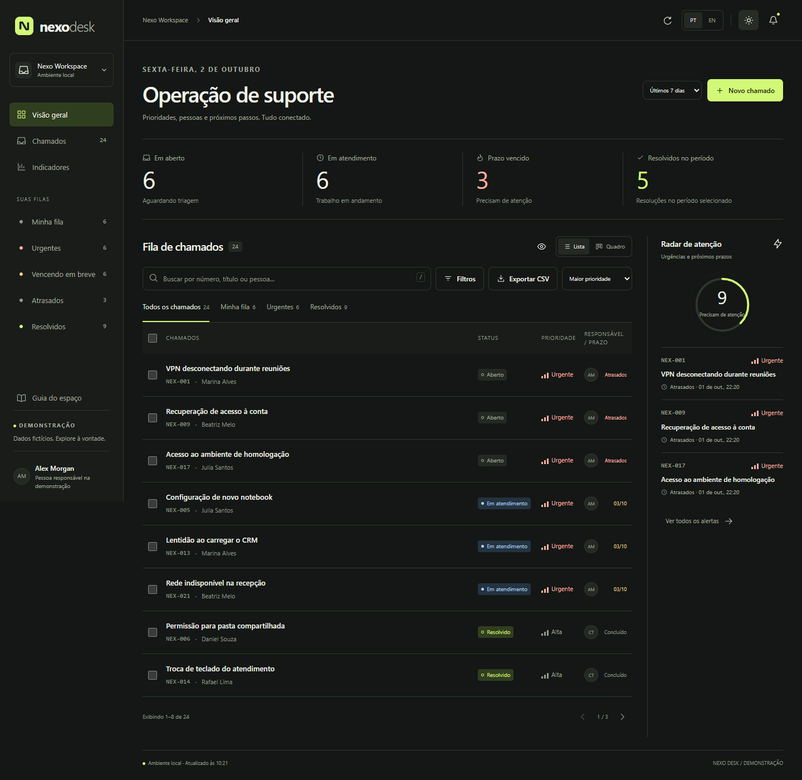
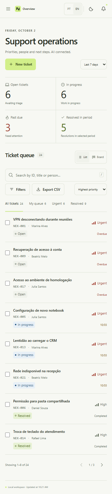

# Nexo Desk

Sistema de chamados para suporte técnico criado como projeto de portfólio. A interface tem português e inglês, temas claro e escuro e animações com GSAP. O desenvolvimento local usa SQLite; a demonstração na Vercel usa PostgreSQL hospedado.



## Como executar

Requer Node.js 22.13 ou superior e npm. No terminal, dentro desta pasta:

```bash
npm install
npm start
```

Abra **http://127.0.0.1:3333**. O servidor escuta apenas em `127.0.0.1` por padrão. Para desenvolvimento, use `npm run dev`; para verificar a API e as regras de negócio, use `npm test`.

Na primeira execução local, o sistema cria `data/nexo.sqlite` e insere 24 chamados fictícios e quatro responsáveis fictícios. Esse banco permanece após reiniciar o servidor. A pasta `data/` com arquivos SQLite não entra no Git. Para voltar aos dados iniciais, pare o servidor e remova o arquivo SQLite local após guardar uma cópia do que quiser preservar.

## O que funciona

- Criar, editar, consultar, buscar, filtrar e ordenar chamados; alternar entre lista paginada e quadro por status.
- Filas de demonstração: minha fila, urgentes, vencendo em breve, atrasados e resolvidos. “Minha fila” usa Alex Morgan como responsável de demonstração.
- Status, prioridades, categorias, etiquetas, responsável e prazo; histórico de alterações e notas internas.
- Fechar e reabrir chamados. Notas internas permanecem neste sistema; nenhum e-mail é enviado.
- Selecionar vários chamados para alterar status ou responsável, com confirmação antes de aplicar.
- Desfazer edições de campos e ações em lote por até 60 segundos, desde que os registros não tenham sido alterados novamente. Criação e notas não entram no desfazer.
- Indicadores calculados a partir do banco e gráficos de volume, prioridade e categoria; período de 7, 30 ou 90 dias para resoluções e fluxo diário.
- Alertas locais para urgentes e prazos próximos; exportação CSV dos resultados filtrados com proteção contra fórmulas em células.
- Idioma PT-BR/EN e tema claro/escuro mantidos no navegador. Chamados e notas permanecem no idioma em que foram escritos. Datas e números seguem o idioma escolhido.
- Atalhos `N` (novo), `/` (busca) e `Esc` (fechar painel), com proteção para quem estiver digitando. Rascunhos de formulários e notas são guardados na sessão do navegador.

Os prazos usam horas corridas: **em dia** quando faltam mais de 24 horas, **vencendo em breve** quando faltam até 24 horas e **atrasado** quando o prazo passou. Chamados resolvidos ou fechados aparecem como concluídos e saem dos alertas. Os alertas são recalculados ao atualizar os dados; não são notificações externas.

## Estrutura

```text
app.js          Entrada Express reconhecida pela Vercel
public/         Interface HTML, CSS e JavaScript sem framework
  app.js        Estado, navegação, formulários e chamadas à API
  views.js      Telas e componentes de interface
  i18n.js       Traduções e formatação
  motion.js     GSAP: timeline, Flip, ScrollTrigger, DrawSVG e CustomEase
  domain.js     Regras compartilhadas de validação e prazo
server/         API Express e armazenamento
  index.js      Rotas HTTP usadas nas duas hospedagens
  database.js   SQLite para desenvolvimento local
  postgres.js   PostgreSQL para a Vercel
  query.js      Filtros e indicadores compartilhados
  demo-data.js  Dados fictícios iniciais
  csv.js        Exportação CSV localizada e segura para planilhas
scripts/        Preparação dos arquivos públicos do GSAP
tests/          Verificações de API e regras de negócio
docs/           Capturas de tela para apresentação
data/           Banco local criado automaticamente (ignorado pelo Git)
vercel.json     Configuração da publicação na Vercel
```

A API usa `/api/meta`, `/api/summary`, `/api/tickets`, `/api/tickets.csv`, `/api/tickets/:id`, `/api/tickets/:id/notes`, `/api/bulk` e `/api/undo`. O frontend recebe os dados via HTTP; os dados não ficam em um array simulado no navegador.

## Direção visual e movimento

O Nexo Desk usa uma área operacional compacta com marca grafite e verde-lima. As referências visuais fornecidas foram [Carmed](https://carmed-bay.vercel.app/) e [Solid Tech](https://www.solidtech.digital/), usadas para estudar ritmo, hierarquia e movimento. Os componentes, textos e identidade são próprios. A composição dos campos, diálogos e estados toma como referência padrões de [shadcn/ui](https://ui.shadcn.com/docs/components), implementados com controles HTML nativos para preservar a arquitetura sem framework.

GSAP coordena a entrada inicial, a passagem entre lista e quadro (`Flip`), a abertura de detalhes, o destaque dos gráficos com `ScrollTrigger`, traços SVG com `DrawSVGPlugin` e uma curva de animação com `CustomEase`. As animações de conteúdo são removidas quando o sistema detecta `prefers-reduced-motion: reduce`; sem GSAP, o conteúdo e os controles continuam visíveis e funcionais.

## Publicar uma demonstração na Vercel

1. Importe o repositório `nexo-desk` como um projeto na Vercel. Mantenha a raiz do projeto como diretório de origem e o framework **Express**.
2. Na Vercel, crie ou conecte um banco PostgreSQL pelo **Storage/Marketplace** (por exemplo, Neon). Use a conexão **pooled** e disponibilize a URL como variável de ambiente `DATABASE_URL` para Production e, se for usar prévias, Preview. Não coloque a URL real em arquivos versionados.
3. Publique o projeto. O build copia os arquivos de GSAP para `public/vendor/`; a Vercel serve os arquivos da interface e executa a API como uma Function. Na primeira chamada à API, o backend cria as tabelas e os 24 chamados fictícios.

Se a integração do banco criar outra variável, configure `DATABASE_URL` nas configurações do projeto com a URL de conexão recebida. Os dados da demonstração na Vercel permanecem no PostgreSQL entre publicações e são compartilhados entre visitantes. A aplicação local continua usando seu próprio SQLite. A URL fictícia em `.env.example` é apenas um modelo.

## Limites da demonstração

Este projeto é para uso **demonstrativo**. Não tem contas, autenticação, permissões reais, envio de e-mail nem anexos. Em uma publicação pública, qualquer pessoa pode consultar e alterar os chamados fictícios, sem autenticação; as alterações ficam visíveis a todos até a base ser reiniciada. Não insira dados pessoais, confidenciais ou de clientes. Para uso real, crie outro projeto e implemente autenticação, permissões e as demais operações necessárias.


